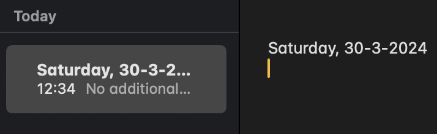

# DailyNotes

## What Is It

DailyNotes is an automated system for Apple Notes that creates a new note with the current date as the title every day. It utilizes a simple AppleScript and a `launchd` job to ensure that you have a fresh note for your daily entries, without the need to manually create one each day.

## How to Use

1. Clone this repository or download the `CreateFolder.scpt` and `com.dailynotes.plist` files to your Mac.
2. Inside `com.dailynotes.plist`, change `<string>your path to CreateFolder.scpt file here</string>` to the actual path of `CreateFolder.scpt` on your Mac.
3. Copy `com.dailynotes.plist` to your `~/Library/LaunchAgents/` directory.
4. Run `launchctl load ~/Library/LaunchAgents/com.dailynotes.plist` to launch the daemon.
5. Done! The script will be executed every day at 00:01 as a daemon! **Recommended**: Run `CreateFolder.scpt` once locally to grant the script all necessary access rights (you will need to click the allow button).

From now on, a daily note with the current date will be automatically created in the header every day:

